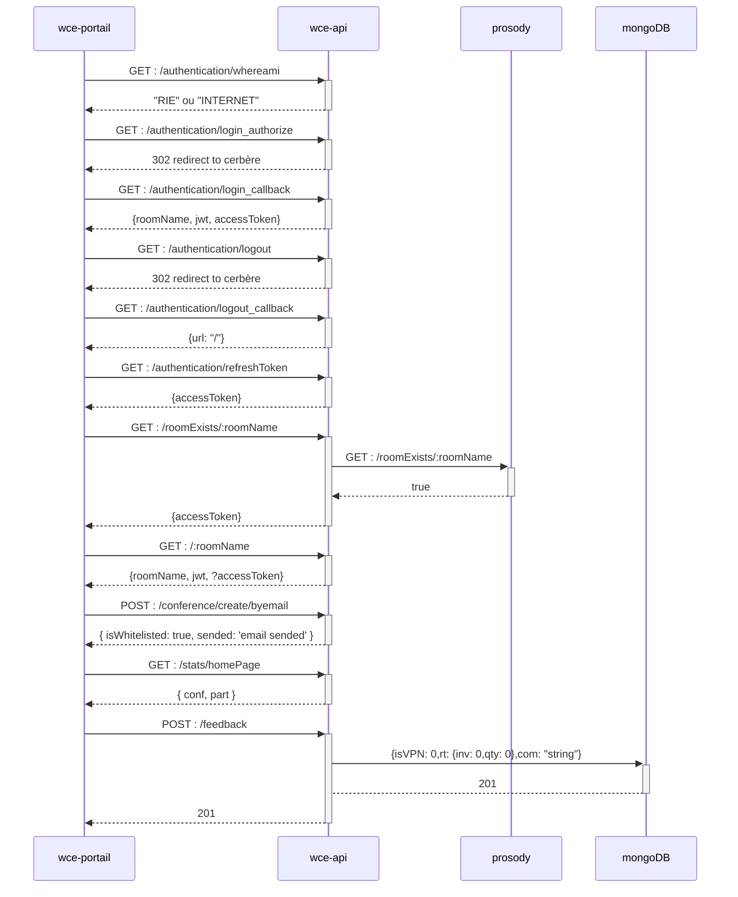

# wce-portail-react-ts

## Description

[Webconf de l'Etat](https://preprod.webconf.numerique.gouv.fr/) is an open source project for webconferencing between agents.

## Sequence diagram



## Installation

```bash

$ npm install

```

## Running the app

```bash

# development

$ npm run dev


# preproduction mode

$ npm run build:preprod


# production mode

$ npm run build:prod

```

## Test

```bash

# unit tests

$ npm run test


# e2e tests

$ npm run test:e2e


# test coverage

$ npm run test:cov

```

## Stay in touch

- Author - [Youssef El Mkhantar](https://github.com/youssefelmkhantar)

- Website - [https://preprod.webconf.numerique.gouv.fr/](https://preprod.webconf.numerique.gouv.fr/)

## License

Webconf is [MIT licensed](LICENSE).
